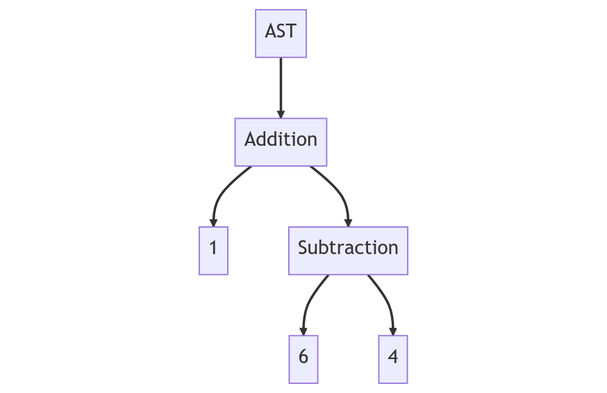
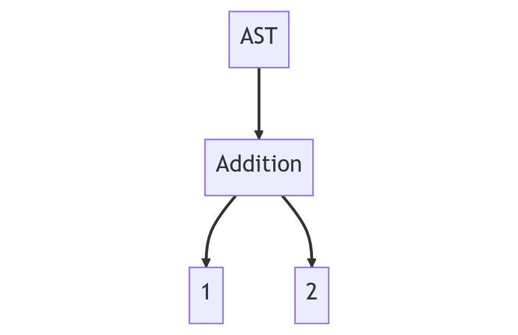
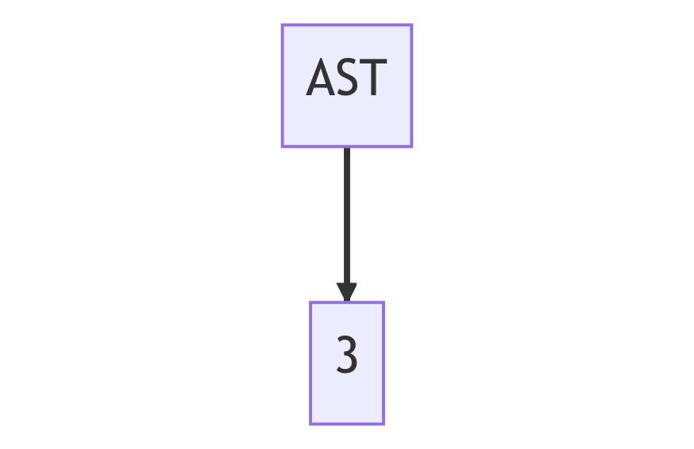

# Precomputing (Not Implemented)

Precomputing is an optional (opt-in) compiler optimization strategy that aims to remove the need to compute values at runtime that could be known at compile time.

## Strategy

To demonstrate the strategy of this method, the complex expression `(6 - 4) + 1` will be reduced to a single value.

Here is the starting AST with a total depth of 3, width of 2, and 3 leaf nodes.

After the first pass of precomputation, the resulting AST has a depth of 2, width of 2, and 2 leaf nodes.

After a third (and final) pass, the AST has a depth of 1, a width of 1, and 1 leaf node.

